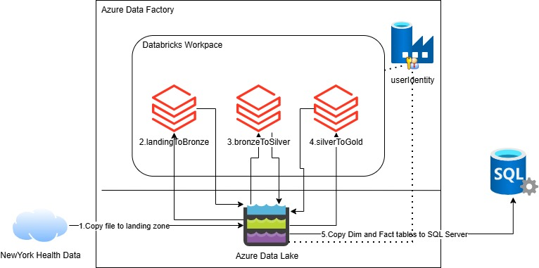

# Contoso's Data Processing Journey: A Project Setup Guide

Welcome to the project setup guide for Contoso's data processing pipeline. This guide will walk you through the steps needed to set up a simple, yet effective, data processing pipeline. The example is simple from a data point of view, but it's designed to help you learn about the technology and how to build the pipeline.

## Prerequisites

Before we embark on this adventure, ensure you have the following tools ready:

- **An Azure subscription**  [free account](https://azure.microsoft.com/pricing/purchase-options/azure-account?cid=msft_learn)
- **Azure CLI**: Version 2.86.0 or higher. Install from [Azure CLI's official page](https://learn.microsoft.com/cli/azure/install-azure-cli).
- **Bash or WSL**: A Bash-compatible shell environment is crucial. If you're on Windows, check out [Windows Subsystem for Linux (WSL)](https://learn.microsoft.com/windows/wsl/install).
- **Databricks CLI**: Optional, but recommended for cluster manipulation. Use version 1.1.0 or higher. For installation instructions, see [Databricks CLI tutorial](https://learn.microsoft.com/azure/databricks/dev-tools/cli/tutorial).

## The Contoso Data Pipeline Adventure

### Step 1: Clone Repository

Navigate to the directory where you want to download the code.

```bash
  git clone https://github.com/Azure-Samples/data-factory-to-databricks.git
  cd data-factory-to-databricks
```

### Step 2: Azure Login

Our journey begins with logging into Azure. Use the command below:

```bash
az login
# Optionally, set the default subscription:
# az account set --subscription <subscription_id>
```

### Step 3: Environment Setup

Like any good adventure, we need to prepare our environment:

```bash
export LOCATION=centralus
export RESOURCEGROUP=rg-data-factory-to-databricks-${LOCATION}
export USER_EMAIL=$(az ad signed-in-user show --query mail -o tsv)
export USER_OBJECTID=$(az ad signed-in-user show --query id -o tsv)
export USER_TENANTID=$(az account show --query tenantId -o tsv)
```

### Step 4: Resource Group Creation

With our map in hand, we create a resource group in our chosen location:

```bash
az group create -n $RESOURCEGROUP -l $LOCATION
```

### Step 5: Deploying Resources

Using a Bicep file, we deploy the resources needed for our data processing quest:

```bash
az deployment group create --name main -f ./main.bicep -g ${RESOURCEGROUP} -p username=${USER_EMAIL} userObjectId=${USER_OBJECTID} userTenantId=${USER_TENANTID}
```



The Bicep file creates:

- A User-Assigned Managed Identity used by Azure Data Factory.
- An Azure Data Lake Storage Gen2 account with `landing`, `bronze`, `silver`, and `gold` containers.
- An Azure Databricks Premium workspace.
- A Databricks Access Connector with a system-assigned managed identity for Unity Catalog storage access.
- An Azure SQL Database configured for Microsoft Entra authentication.
- An Azure Data Factory instance with the sample pipeline.
- A Log Analytics workspace and diagnostic settings for monitoring.

The Tale of Data Transformation:

Our pipeline, depicted below, is a tale of transformation:


The pipeline consumes New York Health data. This example works with baby names https://health.data.ny.gov/Health/Baby-Names-Beginning-2007/jxy9-yhdk/data_preview.

1. Retrieve the file from New York Health Data and store it in the data lake `landing` container.
1. LandingToBronze: A Databricks Notebook moves data to a Delta Table on the `bronze` container. The process **appends** information and adds control metadata, including processing time and file name.
1. BronzeToSilver: Cleaning the data, removing duplicates, and **merging** into the `silver` container.
1. SilverToGold: Populating a star model in the `gold` container.
1. Transfer the star model (including dimension tables and fact table) from the `gold` container to a SQL Database.

### Step 6: The Chronicles of Databricks Notebooks

In the *./notebooks* directory, you'll find the scripts of our chronicles. Upload them to Databricks using the CLI or manually via the Azure portal.

- **Using the Databricks CLI:** The CLI authenticates using your existing Azure CLI session (since you already ran `az login` in Step 2). See [Azure CLI authentication for the Databricks CLI](https://learn.microsoft.com/azure/databricks/dev-tools/cli/authentication#azure-cli-auth).

  ```bash
  # Set the workspace URL (Azure CLI auth is used automatically)
  export DATABRICKS_HOST=$(az deployment group show -g ${RESOURCEGROUP} --name main --query properties.outputs.databricksWorkspaceUrl.value --output tsv)

  # Upload the local notebooks to your workspace
  databricks sync ./notebooks/ /Users/${USER_EMAIL}/myLib
  ```

- **Using the Azure Databricks portal:** You can also do this manually inside Databricks. Import notebooks from the **Workspace** section in the Azure Databricks UI. Azure Data Factory assumes the notebooks are inside a `myLib` folder in the user workspace.

### Unity Catalog one-time setup (required when using external Azure Data Lake Storage -ADLS- paths)

If your workspace uses Unity Catalog and you keep bronze/silver/gold in ADLS paths, run this one-time setup before executing the pipeline. Without this setup, you might get errors like `[NO_PARENT_EXTERNAL_LOCATION_FOR_PATH]`.

1. In Bash/WSL, prepare variables and Azure resources (copy and paste this whole block):

    ```bash
    # Current subscription and resource group
    export SUBSCRIPTION_ID=$(az account show --query id -o tsv)

    # Values created by main.bicep and exposed as deployment outputs
    export ACCESS_CONNECTOR_NAME=$(az deployment group show -g ${RESOURCEGROUP} -n main --query properties.outputs.databricksAccessConnectorName.value -o tsv)
    export ACCESS_CONNECTOR_ID=$(az deployment group show -g ${RESOURCEGROUP} -n main --query properties.outputs.databricksAccessConnectorId.value -o tsv)
    export ACCESS_CONNECTOR_PRINCIPAL_ID=$(az deployment group show -g ${RESOURCEGROUP} -n main --query properties.outputs.databricksAccessConnectorPrincipalId.value -o tsv)
    export STORAGE_ACCOUNT=$(az deployment group show -g ${RESOURCEGROUP} -n main --query properties.outputs.storageAccountName.value -o tsv)
    export STORAGE_ACCOUNT_ID=$(az deployment group show -g ${RESOURCEGROUP} -n main --query properties.outputs.storageAccountResourceId.value -o tsv)

    # Identity that runs notebooks/jobs for this sample.
    # This sample uses the ADF User Assigned Managed Identity as Databricks submitter identity.
    # Databricks identifies service principals by application/client ID.
    export ADF_UAMI_NAME=$(az deployment group show -g ${RESOURCEGROUP} -n main --query properties.outputs.dataFactoryUserManagedIdentityName.value -o tsv)
    export ADF_UAMI_CLIENT_ID=$(az deployment group show -g ${RESOURCEGROUP} -n main --query properties.outputs.dataFactoryUserManagedIdentityClientId.value -o tsv)

    # Workspace default catalog name (used to grant the ADF identity permission to create schemas/tables)
    export WORKSPACE_CATALOG=$(databricks catalogs list --output json | python3 -c "import sys,json; print(next(c['name'] for c in json.load(sys.stdin) if c.get('catalog_type')=='MANAGED_CATALOG'))")

    # Quick verification
    echo "SUBSCRIPTION_ID=$SUBSCRIPTION_ID"
    echo "RESOURCEGROUP=$RESOURCEGROUP"
    echo "ACCESS_CONNECTOR_NAME=$ACCESS_CONNECTOR_NAME"
    echo "ACCESS_CONNECTOR_ID=$ACCESS_CONNECTOR_ID"
    echo "ACCESS_CONNECTOR_PRINCIPAL_ID=$ACCESS_CONNECTOR_PRINCIPAL_ID"
    echo "STORAGE_ACCOUNT=$STORAGE_ACCOUNT"
    echo "ADF_UAMI_CLIENT_ID=$ADF_UAMI_CLIENT_ID"
    echo "ADF_UAMI_NAME==$ADF_UAMI_NAME"
    echo "WORKSPACE_CATALOG=$WORKSPACE_CATALOG"
    ```

    The Bicep deployment creates the Databricks Access Connector with a system-assigned identity and grants it `Storage Blob Data Contributor` on the sample storage account.

2. In Azure Databricks, create the storage credential in the UI **(or update it if `adls_cred` already exists from a previous deployment)**:

    > **⚠️ Important:** The Unity Catalog metastore is account-level and survives resource group deletion. If you deleted and recreated the resource group, the old `adls_cred` credential still exists but points to a now-deleted access connector.

    To create from scratch:

    1. In the sidebar, select **Catalog**.
    2. Select **Create** and then select **Create a credential**.
    3. Select **Storage Credential** and **Azure Managed Identity** as the credential type.
    4. Enter `adls_cred` as the storage credential name.
    5. Paste `${ACCESS_CONNECTOR_ID}` into **Access Connector ID**.
    6. Leave **Managed Identity ID** empty because this sample uses the access connector system-assigned identity.
    7. Select **Create**.

3. Register the ADF managed identity as a Databricks service principal (required so the GRANT statements in the next step can reference it by client ID):

    1. Select your profile photo or username in the top-right bar and select **Settings**.
    2. Select the **Identity and access** tab.
    3. Next to **Service principals**, select **Manage**.
    4. Select **Add service principal** → **Add new**.
    5. Select **Microsoft Entra ID managed**.
    6. Paste the value of `$ADF_UAMI_CLIENT_ID` (printed in step 5) into **Client ID**.
    7. Enter the value of `$ADF_UAMI_NAME` as the display name (e.g., `dataFactoryUserIdentity`).
    8. Select **Add**.


4. Generate a ready-to-paste SQL script for the external locations and grants (copy and paste this in Bash/WSL):

    ```bash
    cat > uc_external_locations_setup.sql <<EOF
    CREATE EXTERNAL LOCATION IF NOT EXISTS landing_ext_loc
    URL 'abfss://landing@${STORAGE_ACCOUNT}.dfs.core.windows.net/'
    WITH (STORAGE CREDENTIAL adls_cred);

    CREATE EXTERNAL LOCATION IF NOT EXISTS bronze_ext_loc
    URL 'abfss://bronze@${STORAGE_ACCOUNT}.dfs.core.windows.net/'
    WITH (STORAGE CREDENTIAL adls_cred);

    CREATE EXTERNAL LOCATION IF NOT EXISTS silver_ext_loc
    URL 'abfss://silver@${STORAGE_ACCOUNT}.dfs.core.windows.net/'
    WITH (STORAGE CREDENTIAL adls_cred);

    CREATE EXTERNAL LOCATION IF NOT EXISTS gold_ext_loc
    URL 'abfss://gold@${STORAGE_ACCOUNT}.dfs.core.windows.net/'
    WITH (STORAGE CREDENTIAL adls_cred);

    GRANT READ FILES, WRITE FILES, CREATE EXTERNAL TABLE ON EXTERNAL LOCATION landing_ext_loc TO \`${ADF_UAMI_CLIENT_ID}\`;
    GRANT READ FILES, WRITE FILES, CREATE EXTERNAL TABLE ON EXTERNAL LOCATION bronze_ext_loc TO \`${ADF_UAMI_CLIENT_ID}\`;
    GRANT READ FILES, WRITE FILES, CREATE EXTERNAL TABLE ON EXTERNAL LOCATION silver_ext_loc TO \`${ADF_UAMI_CLIENT_ID}\`;
    GRANT READ FILES, WRITE FILES, CREATE EXTERNAL TABLE ON EXTERNAL LOCATION gold_ext_loc TO \`${ADF_UAMI_CLIENT_ID}\`;

    -- Grant ADF identity permission to create schemas and tables in the workspace catalog
    GRANT USE CATALOG, CREATE SCHEMA ON CATALOG \`${WORKSPACE_CATALOG}\` TO \`${ADF_UAMI_CLIENT_ID}\`;

    EOF
    ```

5. In Azure Databricks, execute the generated SQL:

    1. In the sidebar, click **Queries**.
    2. Create a new query in the SQL query editor.
    3. Copy the output of `cat uc_external_locations_setup.sql` and paste it into the editor.
    4. Select "Run all".
    5. Select a running SQL warehouse, or start one and wait until it is ready.
    6. Wait for the query to finish running, and confirm that the statements complete successfully.


6. Validate the setup.

    Run the following SQL and verify the statements complete successfully:

    ```sql
    SHOW EXTERNAL LOCATIONS;
    DESCRIBE EXTERNAL LOCATION landing_ext_loc;
    DESCRIBE EXTERNAL LOCATION bronze_ext_loc;
    DESCRIBE EXTERNAL LOCATION silver_ext_loc;
    DESCRIBE EXTERNAL LOCATION gold_ext_loc;
    ```

    __NOTE:__ [Notebooks](https://learn.microsoft.com/azure/databricks/notebooks/) are the primary tool for creating data science and machine learning workflows on Azure Databricks. Databricks notebooks provide real-time coauthoring in multiple languages, automatic versioning, and built-in data visualizations for developing code and presenting results. You can see and read the notebooks using Visual Studio Code, the notebooks have comments explaining what they are doing. In this example we are using mainly Python and SQL.

### Step 7: The SQL Database Saga

Our data analyst, armed with insights, creates a star model in the SQL database to be populated by the pipeline.

1. In the Azure portal, open your SQL database resource.

2. On the SQL database **Overview** page, select **Query editor (preview)** from the resource menu.

3. On the sign-in screen, choose **Microsoft Entra authentication** and select **Continue as <your-user>**.

    You might need to add your IP address to the server's allowlist before you can sign in. Follow the prompts in the Azure portal.

4. Copy the code from `./sql/star_model.sql` and paste it into **New Query**.

5. Select **Run**.

6. Review the tables that were created and explore any [stored procedures](https://learn.microsoft.com/azure/data-factory/connector-sql-server?tabs=data-factory#invoke-a-stored-procedure-from-a-sql-sink).

7. To grant database permissions to the Azure Data Factory managed identity, copy the code from `./sql/UserManageIdentity.sql` into **New Query**.

8. Select **Run** again.

### Step 8: Execute the Azure Data Factory Pipeline

1. Go to your Azure Data Factory resource in the Azure portal.

2. Select **Launch Studio**.

3. Go to **Author** > **Pipelines** -> **IngestNYBabyNames_PL**.

4. Select **Trigger** in the menu above the pipeline canvas, and then select **Trigger Now**.

5. Select **OK** to start to run the pipeline.

### Step 9: Monitoring

You can [natively monitor all of your pipeline runs](https://learn.microsoft.com/azure/data-factory/monitor-visually#monitor-pipeline-runs) in the Azure Data Factory user experience.

Select the **Monitor** tile in the Data Factory Studio, and then **Pipeline runs**.

By default, all data factory runs are displayed in the browser's local time zone. If you change the time zone, all date/time fields adjust to the one you've selected.

Azure Databricks does not send logs to Azure Monitor by default, but you can enable [diagnostic log delivery](https://learn.microsoft.com/azure/databricks/admin/account-settings/audit-log-delivery) (for example, to Log Analytics). For pipeline-level troubleshooting in this sample, you can still select the notebook execution activity (it may take some time to appear), select the glasses icon, and follow the [Databricks link to check the notebook execution log](https://learn.microsoft.com/azure/data-factory/transform-data-using-databricks-notebook#monitor-the-pipeline-run).

Wait for the pipeline to complete successfully. It might take up to 20 minutes to complete the pipeline run.

The solution uses [Azure Data Lake Storage](https://learn.microsoft.com/azure/storage/blobs/data-lake-storage-introduction). A data lake is a single, centralized repository where you can store all your data, both structured and unstructured. Azure Data Lake Storage is a set of capabilities dedicated to big data analytics, built on Azure Blob Storage. It is possible to check it. Navigate to the resource group, select the Storage Account and see the containers. You will be able to find a 'landing' container where the .csv from api was stored, or bronze, silver and gold containers with the [delta tables](https://learn.microsoft.com/azure/databricks/delta/). All new tables in Databricks are, by default created as Delta tables. A Delta table stores data as a directory of files in cloud object storage and registers that table's metadata to the metastore within a catalog and schema.

### Step 10: The Quest for Insights

After the pipeline populates the database, you can execute queries in the SQL Database to uncover the most popular names and trends.

In the Azure portal, navigate to the resource group, open the Azure SQL Database, and then open the SQL Database Query Editor.

```sql
-- most common female names used in New York in 2019
SELECT top 10  n.first_name, SUM(f.count) AS total_count
FROM [data].[fact_babynames] f
JOIN [data].[dim_names] n ON f.nameSid = n.sid
JOIN [data].[dim_years] y ON f.yearSid = y.sid
WHERE n.sex = 'F' and y.year = 2019
GROUP BY n.first_name
ORDER BY total_count DESC

-- Abel by year
SELECT y.year, sum(f.count) as total_count
FROM [data].[fact_babynames] f
JOIN [data].[dim_names] n ON f.nameSid = n.sid
JOIN [data].[dim_years] y ON f.yearSid = y.sid
WHERE n.first_name= 'ABEL'
GROUP BY y.year
ORDER BY total_count DESC
```

### Step 11: The Journey's End

When you're done, delete the resources and the resource group.

> **⚠️ Clean up Unity Catalog first!** The Unity Catalog metastore is account-level and persists after resource group deletion. If you plan to redeploy, run the following in the Databricks SQL Editor **before** deleting the resource group — otherwise stale credentials and locations will remain and cause errors on the next deployment:
>
> ```sql
> DROP TABLE IF EXISTS bronze.new_york_baby_names;
> DROP TABLE IF EXISTS gold.reference_dim_names;
> DROP TABLE IF EXISTS gold.reference_dim_years;
> DROP TABLE IF EXISTS gold.reference_dim_locations;
> DROP TABLE IF EXISTS gold.fact_baby_names;
> DROP SCHEMA IF EXISTS bronze CASCADE;
> DROP SCHEMA IF EXISTS silver CASCADE;
> DROP SCHEMA IF EXISTS gold CASCADE;
> DROP EXTERNAL LOCATION IF EXISTS landing_ext_loc FORCE;
> DROP EXTERNAL LOCATION IF EXISTS bronze_ext_loc FORCE;
> DROP EXTERNAL LOCATION IF EXISTS silver_ext_loc FORCE;
> DROP EXTERNAL LOCATION IF EXISTS gold_ext_loc FORCE;
> DROP STORAGE CREDENTIAL IF EXISTS adls_cred FORCE;
> ```
>
> **Remove the service principal from Databricks:**
> The ADF managed identity registered as a Databricks service principal also persists at the account level. Remove it to avoid stale entries on redeployment:
>
> 1. In Databricks, select your username → **Settings**.
> 2. Select **Identity and access** → next to **Service principals**, select **Manage**.
> 3. Select the `dataFactoryUserIdentity` entry.
> 4. Select **Delete**.

After cleaning up Unity Catalog, delete the resource group:

```bash
# First Navigate to resource group locks, then delete of all them. Next, execute the script.

az group delete -n $RESOURCEGROUP -y
```

## Contributions

Please see our [Contributor guide](./CONTRIBUTING.md).

This project has adopted the [Microsoft Open Source Code of Conduct](https://opensource.microsoft.com/codeofconduct/). For more information see the [Code of Conduct FAQ](https://opensource.microsoft.com/codeofconduct/faq/) or contact <opencode@microsoft.com> with any additional questions or comments.

With :heart: from Microsoft Patterns & Practices, [Azure Architecture Center](https://aka.ms/architecture).
